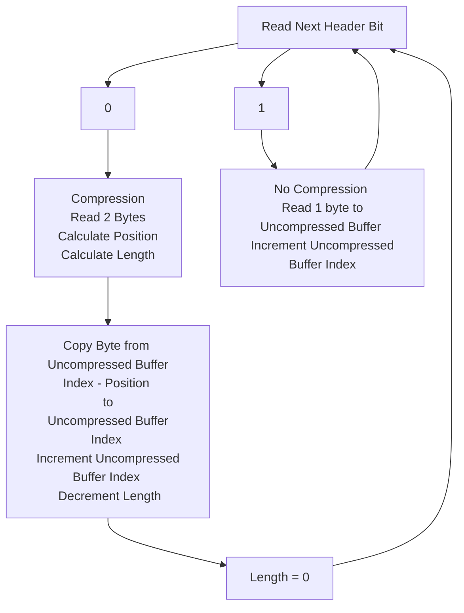
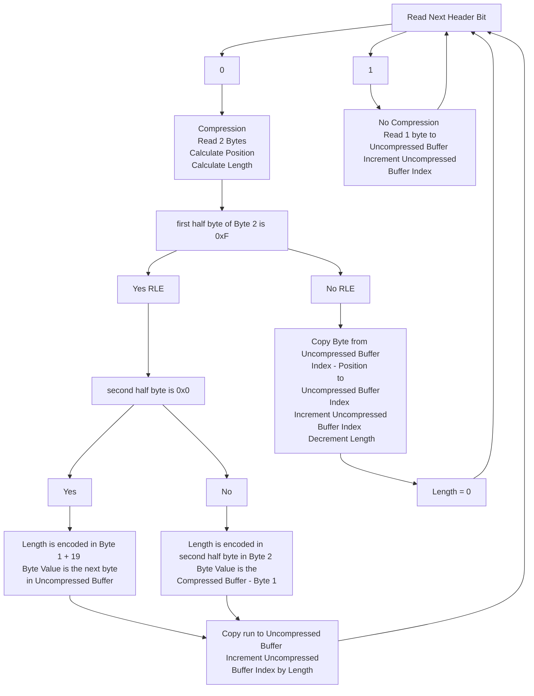

# Star Ocean 2 compression Overview

Star Ocean 2 compresses a lot of its assets.

The compressed files start with the header in ASCII SLZ
the last byte is either a 0, 1 or 2.
This indicates the type of archive.

The next 12 bytes include header information as such:

| bytes |  0:3  |  4:7  |  8:11 | 12:15 | 
| -----| ----- | ----- | ----- | ----- |
|data | SLZ + Mode  | Compressed Size int32  | Decompressed Size int32 | Offset of Part 2 (if exists)|
|Example | 53(S) 4C(L) 5A(Z) 02(Mode)  | 4C 06 00 00 (1612 bytes)  | 78 1C 00 00 (7288 bytes) | 5C 06 00 00 (1628 bytes)|

## Mode 0
In mode 0 no compression is used, so the raw file contents are after the 16 byte header.

## Mode 1
Mode 1 is a LZSS style compression.
It is made up of sections that have a 1 byte header, with the operation encoded in the bits.
Followed by 8 to 16 bytes which will be used in the operations.

A bit value of 1 is then the next byte is uncompressed and can be copied directly to the uncompressed data buffer.
A bit value of 0 means there is compression, using a previously uncompressed run of bytes.
In this case 2 more bytes are read.
Within those 2 bytes a position offset and the length of the run are encoded.
The position is encoded within 12bits and the length in 4 bits.
The minimum length is 3, so when encoded in 4 bits the range will be 3 - 18, instead of 0 to 15.

If read as 2 individual bytes on a 
The position (P) and length (L) would be encoded as follows:
|Byte 1 | Byte 2|
| ----- | ----- |
| PPPP PPPP  | LLLL PPPP|

To recover the position and length we can use the following C psuedo-code:

`unsigned int position = Byte1 | ((Byte2 & 0x0F) << 8)`

`unsigned int length = (Byte2 >> 4) + 3`

Where | is a bitwise or, << 8 is a left shift by 8, >> 4 is a right shift by 4.

Between the section headers there will be 8 bytes if there is no compression of that section, and 16 bytes if the entire section has compression.
So each section can vary between 8 and 16 bytes between headers.

## Mode 2
Mode 2 is very similar to Mode 1 however it also includes Run Length Encoding (RLE).

However after reading the compression position and length bytes when we encounter a 0 in the section header, there is a branch in how we handle the 2 bytes.

|Byte 1 | Byte 2|
| ----- | ----- |
| PPPP PPPP  | LLLL PPPP|

If the LLLL bytes are 0xF (15) then that signals there is run length ecoding.
If the P bits in Byte 2 are all zero then the run length is Byte 1 + 19, and the byte value for the run is the next byte.
If the P bits in Byte 2 are non-zero then they encode the length of the run, and the P bits in Byte 1 encode the position offset, in the uncompressed buffer for the byte value of the run.

Otherwise Mode 2 is the same as Mode 1.

